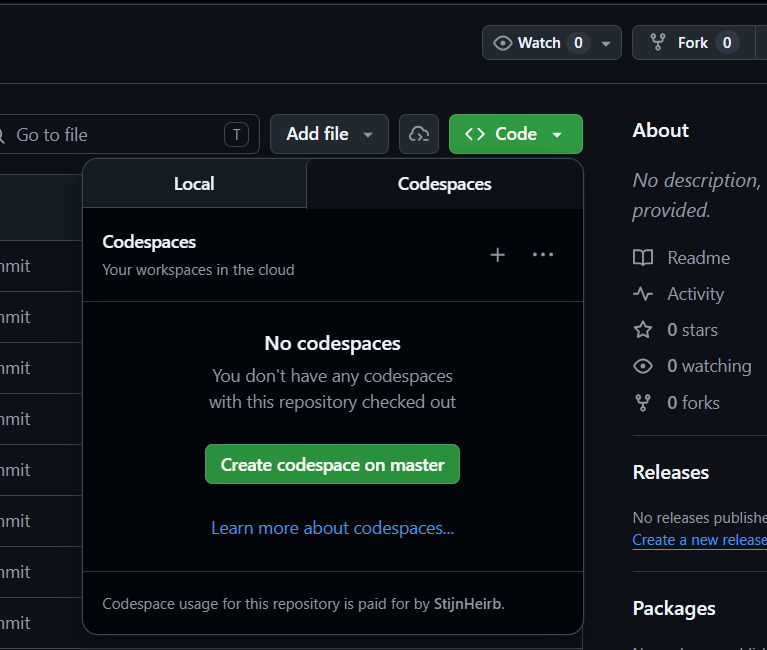
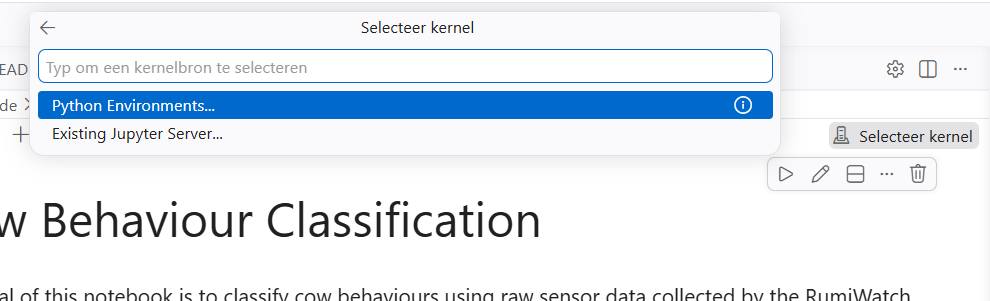

# 📊 AI4AS - EAAP 2026: Summer school "Pitfalls in machine learning"

> Jupyter notebooks on Pitfalls in Machine Learning in Animal Science.

---

This repository contains all the code and exercises for the AI4AS Summer school Pitfalls in machine learning. The solutions will be provided during the class and afterwards published on github:

The slides can be found in:
docs/AI4AS pitfalls in machine learning.pdf

## 📁 Project Structure

```bash
.
├── data/
│   ├── raw/            # Original raw datasets
│   └── processed/      # Data processed by scripts and/or notebooks and saved afterwards
├── notebooks_code/     # Jupyter notebooks
├── docs/               # Slides
├── README.md           # Project overview

```

---

## ⚙️ Getting Started

### 📦 Clone and Initialize the Environment

1. First, fork this repository to your own GitHub account so you that you have your own copy:
  - Open the repository on GitHub.
  - Click **Fork** (top-right) and create your own copy.

2. This project includes a `.devcontainer` and `requirements.txt`, the easiest way to start is with **GitHub Codespaces** and code directly in a web browser with VSCode without any local installation. A Codespace acts as a **remote development environment in the cloud**.   Alternatively, you can clone the forked repository locally and set up a virtual environment to install the required packages (in VS Code, open the Command Palette and select **Python: Create Environment**).

To get started with the github codespace, you can follow the next steps:
  - Open **your forked repository** on GitHub.
    - Click **Code** → **Codespaces** (see Figure 1). For best performance and to avoid kernel issues, select the largest available machine type (see "+...").
    
    <figure>
      
      <figcaption><strong>Figure 1.</strong> Creating a new Codespace from the repository Code menu.</figcaption>
    </figure>

  - Wait until the container finishes building (this may take a few minutes the first time).
  - Open the first Jupyter notebook and select the kernel (Python 3.12) (see Figure 2).
    
    <figure>
      
      <figcaption><strong>Figure 2.</strong> Selecting the kernel in a Codespace.</figcaption>
    </figure>
    
 
  - Always Save/sync your work by committing and pushing changes to your fork (otherwise your work in Codespaces can be lost if the environment is stopped or deleted):

    1. After each exercise, save your notebook (`Ctrl+S` / `Cmd+S`).
    2. Open the **Source Control** tab in VS Code (branch icon).
    3. Review changed files and write a short commit message, for example: `Exercise 1 finished`.
    4. Click **Commit**.
    5. Click **Sync Changes** (or **Push**) to upload your work to your GitHub fork.

    **Tip:** Commit and push regularly (e.g., every 15-30 minutes) to avoid losing progress.

If you would like to inspect datasets visually during the course, you can install the **Data Wrangler** extension from the Extensions panel (left sidebar). After installation, a **View Data** button will appear at the top.